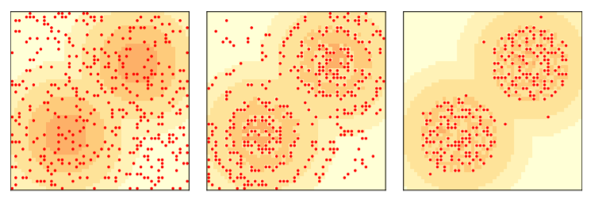

# Sugarscape model in the midst of an epidemic
###### by Ally Bell and Mahima Beltur

## Abstract
The Sugarscape model is a simplified representation of resource seeking behaviors in societies. In this project we explore how the behaviors of our agents are modified with the introduction of an epidemic disease to the population. The disease will spread to close by agents and greatly increase the probability of the agent dying. They are able to minimize this risk by "social distancing" from other ill agents. We modelled the effect of prioritizing life over sugar collection on the overall lifespan and behavior of the agents. We observed various clustering behaviors depending on the weighting of priorities with there being no clustering at all when agents disregarded the illness. Surprisingly, agents are more likely to die by starvation than by the illness itself. With the parameters in this model, we are able to observe and adjust factors in a simplified epidemic spread, and how social distancing and necessary clustering of individuals for resources contribute.

## Background

Sugarscape is an agent based model proposed in 1996 by Joshua Epstein and Robert Axtell where agents move around a 2-D grid harvesting and storing sugar. Across this grid, sugar is produced in different amounts, which agents need to survive.

Each agent starts the simulation with some amount of sugar, and some amount they need to consume for sustenance per step. They can see the amount of sugar in a radius of neighboring cells and and move towards it accordingly, although some agents can move and see further than others. These three factors give some agents advantages, leading to unequal wealth (sugar) distribution. 

For each time step, agents move in a random order. They look at the cells within the radius of vision they have, choose the unoccupied cell with the most sugar (in a tie, they pick the closest cell or choose randomly), move to the selected cell, and harvest sugar. At the end of this movement, they consume the amount of sugar they need. If they do not have enough sugar stored to fulfill this, they "die" and are removed from the grid.

In this replication of the original model, we can see the agents, denoted by red dots, move around the grid over three time steps: zero, two, and one-hundred, going from left to right. The amount of sugar in each cell is shown based on its color, the darker orange the cell, the more sugar present. We can see that over time, agents cluster around areas with the highest sugar concentration.

## Methodology

We took the original Sugarscape model, and introduced a disease. This disease spreads between agents at a variable level of contagion, and with varying fatality. Sugarscape assigns each agent a random location, metabolism rate, and a range of vision and a lifespan that all fall into a ‘normal’ predetermined range. We first began by assigning each agent a status which can take the values 0 for ‘not sick’ or 1 for ‘sick. We initialize each agent with a status 0, and then select some random agents to be our patient 0. For this model we begin with 10 sick agents and 290 healthy ones. Each agent is affected by others in a radius around them and are at risk for infection if there are multiple sick agents in their vicinity. In a risky position, the probability of the healthy agent being infected in 0.65. Once infected, the length to recovery is chosen randomly. At each time step, an infected agent has a 0.01 chance of dying, or a 0.7 chance of recovery. If they exceed the randomly selected life expectancy for their illness, they die. Once successfully recovered, agents have a 0.01 chance to gain immunity against the disease, preventing some of them from further illness and, making them less likely to spread the disease again. Agents are again represented by dots, red for infected agents and blue for healthy ones.

Agents are biased to avoid other agents that are infected in the same way they are biased to move towards sugar, and we tried a range of weightings for these priorities. Namely: 100% priority towards food, 100% priority towards distancing from illness, 75% priority towards food, 75% priority towards distancing from illness and a 50-50 split between both. To analyze each location, agents take a weighted sum of the food available in that location and subtract the number of close-by infected agents there. They choose their next location by maximizing this calculation. Each agent has a varying radius of vision, and are able to make a decision based on how far they can see.

## Results

We ran this model with different sets of priorities between finding sugar and avoiding sick neighbors. The constant parameters in this experiment are: 0.65 rate of infection when exposed, 0.7 recovery rate for each timestep, 0.01 chance of dying from illness on each timestep. Shown in the following figures, we can see the behavior of agents over three time steps with different ratios of the behavior they prioritized.

In our first simulation, agents only look at finding sugar, as in the original Sugarscape model. We see a very similar behavior, where agents cluster around areas of high sugar concentration. 

The second figure shows the reason for death over the course of the simulation. There are five ways an agent can die: from starvation, from old age, from having the disease for too long, and from the random change of dying from infection. With the parameters in this first simulation, the majority of deaths are caused by starvation, peaking below ten deaths per step. 

<!--  -->

<!--  -->

In the second simulation, agents only care about avoiding infected neighbors. Here, we see a massively greater number of agents die. By completely ignoring the need to find and harvest sugar, agents rapidly die from starvation, and the population plummets. There is a small spike in infections from illness, almost exactly mirroring the deaths from illness seen in the previous example. Agents are seen forming small clusters at the edges of high density sugar areas, although for the most part avoiding going in.

<!--  -->

<!--  -->

Next, agents weight these two needs evenly, and again, we see a massive spike in agents dying from starvation at the beginning of the model. The need to avoid sick neighbors appears to greatly outweigh the need for sugar, and the population again rapidly declines. We see practically no deaths from infection in this scenario, perhaps because of the decreased population sign, and thus ability to avoid other agents with greater ease.
<!-- 
 -->

<!--  -->

In the fourth simulation, food is given a weight of 25% and avoiding infection 75%. This is the highest spike in deaths we've seen yet - peaking over 25 deaths per step. The priority of moving away from neighbors seems to have a much larger impact here than in the scenario where agents didn't look at sugar at all.

<!--  -->

<!--  -->

Our final scenario weights finding sugar at 75% and avoiding infection at 25%. Death rate here is the lowest we've seen in a scenario where agents try to avoid infected neighbors, with a much lower spike in deaths from starvation and no deaths from infection. They again form clusters around the edges of high density sugar, but much less strictly and in looser groups.

<!--  -->

<!--  -->

In the following figures, we compare the results of these different priority ratios.

<!--  -->

<!--  -->

<!--  -->

The number of agents sick seems to spike at the beginning in all scenarios, and then quickly drop and level out as the time steps progress. We think this is because agents start the simulation randomly spread out across the grid, and quickly move towards an equilibrium away form each other, or at least in clusters across the space, leading to smaller outbreaks. Also, as the majority of the sick agents die out, the density of the population greatly decreases resulting in fewer agents being infected in each timestep. 

One interesting behavior seen here is in the agents who were only looking for food. These agents faced much higher rates of infection, but still followed a surprisingly similar infection curve to  the agents who looked to avoid sick neighbors. Despite higher levels of infection, these agents maintained a much larger population. Coupled with the observation that nearly all agents die due to starvation across all the models, we observe that, for the purposes of this model, it is more important for each agent to maintain their resources than health. In the first model, where the only priority is food, all agents are able to access the highest density of sugar, while in the other models  the agents cluster in areas of lowwe sugar density to avoid contact with the illness and therefore suffer as a result. 

Looking at the comparison of the CDF distributions, it follows from the previous discussion that populations that care more about food than the illness have, overall, a larger amount of wealth. The largest mass of wealth is won by the population that cares solely for sugar collection. This follows as they are more willing to to venture into areas of high food production despite risking exposure. It is interesting to note that across all of the models, only a few members of the population control the majority of the wealth. The correlation between the range of vision of the individuals and their quantity of sugar is yet to be studied. 

## Future Steps
Going forward, there's a range of possible expansions for this model. We would be interested in running the model over longer time steps, at different rates of infection, and with different population distributions. In the current model, most agent deaths are caused by starvation rather than disease, and exploring factors to push this equilibrium could be insightful. This model has a huge range of factors, and we would like to isolate the ones that drive behavior.

We would also be interested in developing a visual representation to track agents paths over time, and looking at the clustering around agents when they are infected and as they spread it. Tracking the clustering around the agents at the time of spread, and the correlation of infection rates with clustering could tell us more about how these disease spreads, and if we can see super-spreader events, as we do with real world epidemics.

## Bibliograpy

Downey, Allen. “Chapter 9 Agent Based Models.” *Think Complexity: Complexity Science and Computational Modeling*, O'Reilly, 2018. 

Frias-Martinez, Enrique, et al. “An Agent-Based Model of Epidemic Spread Using Human 	Mobility and Social Network Information.” *2011 IEEE Third International Conference on Privacy, Security, Risk and Trust and 2011 IEEE Third International Conference on Social Computing*, 2011, https://doi.org/10.1109/passat/socialcom.2011.142. 

Pan, Rong. “Rebellion on Sugarscape: Case Studies for Greed and Grievance Theory of Civil Conflicts Using Agent-Based Models.” *Social Computing, Behavioral-Cultural Modeling and Prediction*, 1 Aug. 2011, pp. 333–340., https://doi.org/10.1007/978-3-642-19656-0_46. 

